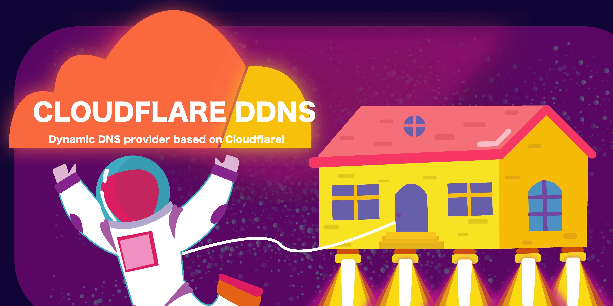

<p align="center"><a href="https://timknowsbest.com/free-dynamic-dns" target="_blank" rel="noopener noreferrer"></a></p>

# 🌍 Cloudflare DDNS

Access your home network remotely via a custom domain name without a static IP!

A feature-complete dynamic DNS client for Cloudflare, written in Rust. The **smallest and most memory-efficient** open-source Cloudflare DDNS Docker image available — **~1.9 MB image size** and **~3.5 MB RAM** at runtime, smaller and leaner than Go-based alternatives. Built as a fully static binary from scratch with zero runtime dependencies.

Configure everything with environment variables. Supports notifications, heartbeat monitoring, WAF list management, flexible scheduling, and more.

[](https://hub.docker.com/r/timothyjmiller/cloudflare-ddns) [](https://hub.docker.com/r/timothyjmiller/cloudflare-ddns)

## ✨ Features

- 🔍 **Multiple IP detection providers** — Cloudflare Trace, Cloudflare DNS-over-HTTPS, ipify, local interface, custom URL, or static IPs
- 📡 **IPv4 and IPv6** — Full dual-stack support with independent provider configuration
- 🌐 **Multiple domains and zones** — Update any number of domains across multiple Cloudflare zones
- 🃏 **Wildcard domains** — Support for `*.example.com` records
- 🌍 **Internationalized domain names** — Full IDN/punycode support (e.g. `münchen.de`)
- 🛡️ **WAF list management** — Automatically update Cloudflare WAF IP lists
- 🔔 **Notifications** — Shoutrrr-compatible notifications (Discord, Slack, Telegram, Gotify, Pushover, generic webhooks)
- 💓 **Heartbeat monitoring** — Healthchecks.io and Uptime Kuma integration
- ⏱️ **Cron scheduling** — Flexible update intervals via cron expressions
- 🧪 **Dry-run mode** — Preview changes without modifying DNS records
- 🧹 **Graceful shutdown** — Signal handling (SIGINT/SIGTERM) with optional DNS record cleanup
- 💬 **Record comments** — Tag managed records with comments for identification
- 🎯 **Managed record regex** — Control which records the tool manages via regex matching
- 🎨 **Pretty output with emoji** — Configurable emoji and verbosity levels
- 🔒 **Zero-log IP detection** — Uses Cloudflare's [cdn-cgi/trace](https://www.cloudflare.com/cdn-cgi/trace) by default
- 🏠 **CGNAT-aware local detection** — Filters out shared address space (100.64.0.0/10) and private ranges
- 🚫 **Cloudflare IP rejection** — Optionally reject Cloudflare anycast IPs to prevent incorrect DNS updates
- 🤏 **Tiny static binary** — ~1.9 MB Docker image built from scratch, zero runtime dependencies

## 🚀 Quick Start

```bash
docker run -d \
  --name cloudflare-ddns \
  --restart unless-stopped \
  --network host \
  -e CLOUDFLARE_API_TOKEN=your-api-token \
  -e DOMAINS=example.com,www.example.com \
  timothyjmiller/cloudflare-ddns:latest
```

That's it. The container detects your public IP and updates the DNS records for your domains every 5 minutes.

> ⚠️ `--network host` is required to detect IPv6 addresses. If you only need IPv4, you can omit it and set `IP6_PROVIDER=none`.

## 🔑 Authentication

| Variable | Description |
|----------|-------------|
| `CLOUDFLARE_API_TOKEN` | API token with "Edit DNS" capability |
| `CLOUDFLARE_API_TOKEN_FILE` | Path to a file containing the API token (Docker secrets compatible) |

To generate an API token, go to your [Cloudflare Profile](https://dash.cloudflare.com/profile/api-tokens) and create a token capable of **Edit DNS**.

## 🌐 Domains

| Variable | Description |
|----------|-------------|
| `DOMAINS` | Comma-separated list of domains to update for both IPv4 and IPv6 |
| `IP4_DOMAINS` | Comma-separated list of IPv4-only domains |
| `IP6_DOMAINS` | Comma-separated list of IPv6-only domains |

Wildcard domains are supported: `*.example.com`

At least one of `DOMAINS`, `IP4_DOMAINS`, `IP6_DOMAINS`, or `WAF_LISTS` must be set.

## 🔍 IP Detection Providers

| Variable | Default | Description |
|----------|---------|-------------|
| `IP4_PROVIDER` | `ipify` | IPv4 detection method |
| `IP6_PROVIDER` | `cloudflare.trace` | IPv6 detection method |

Available providers:

| Provider | Description |
|----------|-------------|
| `cloudflare.trace` | 🔒 Cloudflare's `/cdn-cgi/trace` endpoint (default, zero-log) |
| `cloudflare.doh` | 🌐 Cloudflare DNS-over-HTTPS (`whoami.cloudflare` TXT query) |
| `ipify` | 🌎 ipify.org API |
| `local` | 🏠 Local IP via system routing table (no network traffic, CGNAT-aware) |
| `local.iface:<name>` | 🔌 IP from a specific network interface (e.g., `local.iface:eth0`) |
| `url:<url>` | 🔗 Custom HTTP(S) endpoint that returns an IP address |
| `literal:<ips>` | 📌 Static IP addresses (comma-separated) |
| `none` | 🚫 Disable this IP type |

## 🚫 Cloudflare IP Rejection

| Variable | Default | Description |
|----------|---------|-------------|
| `REJECT_CLOUDFLARE_IPS` | `false` | Reject detected IPs that fall within Cloudflare's IP ranges |

Some IP detection providers occasionally return a Cloudflare anycast IP instead of your real public IP. When this happens, your DNS record gets updated to point at Cloudflare infrastructure rather than your actual address.

Setting `REJECT_CLOUDFLARE_IPS=true` prevents this. Each update cycle fetches [Cloudflare's published IP ranges](https://www.cloudflare.com/ips/) and skips any detected IP that falls within them. A warning is logged for every rejected IP.

## ⏱️ Scheduling

| Variable | Default | Description |
|----------|---------|-------------|
| `UPDATE_CRON` | `@every 5m` | Update schedule |
| `UPDATE_ON_START` | `true` | Run an update immediately on startup |
| `DELETE_ON_STOP` | `false` | Delete managed DNS records on shutdown |

Schedule formats:

- `@every 5m` — Every 5 minutes
- `@every 1h` — Every hour
- `@every 30s` — Every 30 seconds
- `@once` — Run once and exit

When `UPDATE_CRON=@once`, `UPDATE_ON_START` must be `true` and `DELETE_ON_STOP` must be `false`.

## 📝 DNS Record Settings

| Variable | Default | Description |
|----------|---------|-------------|
| `TTL` | `1` (auto) | DNS record TTL in seconds (1=auto, or 30-86400) |
| `PROXIED` | `false` | Expression controlling which domains are proxied through Cloudflare |
| `RECORD_COMMENT` | (empty) | Comment attached to managed DNS records |
| `MANAGED_RECORDS_COMMENT_REGEX` | (empty) | Regex to identify which records are managed (empty = all) |

The `PROXIED` variable supports boolean expressions:

| Expression | Meaning |
|------------|---------|
| `true` | ☁️ Proxy all domains |
| `false` | 🔓 Don't proxy any domains |
| `is(example.com)` | 🎯 Only proxy `example.com` |
| `sub(cdn.example.com)` | 🌳 Proxy `cdn.example.com` and its subdomains |
| `is(a.com) \|\| is(b.com)` | 🔀 Proxy `a.com` or `b.com` |
| `!is(vpn.example.com)` | 🚫 Proxy everything except `vpn.example.com` |

Operators: `is()`, `sub()`, `!`, `&&`, `||`, `()`

## 🛡️ WAF Lists

| Variable | Default | Description |
|----------|---------|-------------|
| `WAF_LISTS` | (empty) | Comma-separated WAF lists in `account-id/list-name` format |
| `WAF_LIST_DESCRIPTION` | (empty) | Description for managed WAF lists |
| `WAF_LIST_ITEM_COMMENT` | (empty) | Comment for WAF list items |
| `MANAGED_WAF_LIST_ITEMS_COMMENT_REGEX` | (empty) | Regex to identify managed WAF list items |

WAF list names must match the pattern `[a-z0-9_]+`.

## 🔔 Notifications (Shoutrrr)

| Variable | Description |
|----------|-------------|
| `SHOUTRRR` | Newline-separated list of notification service URLs |

Supported services:

| Service | URL format |
|---------|------------|
| 💬 Discord | `discord://token@webhook-id` |
| 📨 Slack | `slack://token-a/token-b/token-c` |
| ✈️ Telegram | `telegram://bot-token@telegram?chats=chat-id` |
| 📡 Gotify | `gotify://host/path?token=app-token` |
| 📲 Pushover | `pushover://user-key@api-token` |
| 🌐 Generic webhook | `generic://host/path` or `generic+https://host/path` |

Notifications are sent when DNS records are updated, created, deleted, or when errors occur.

## 💓 Heartbeat Monitoring

| Variable | Description |
|----------|-------------|
| `HEALTHCHECKS` | Healthchecks.io ping URL |
| `UPTIMEKUMA` | Uptime Kuma push URL |

Heartbeats are sent after each update cycle. On failure, a fail signal is sent. On shutdown, an exit signal is sent.

## ⏳ Timeouts

| Variable | Default | Description |
|----------|---------|-------------|
| `DETECTION_TIMEOUT` | `5s` | Timeout for IP detection requests |
| `UPDATE_TIMEOUT` | `30s` | Timeout for Cloudflare API requests |

## 🖥️ Output

| Variable | Default | Description |
|----------|---------|-------------|
| `EMOJI` | `true` | Use emoji in output messages |
| `QUIET` | `false` | Suppress informational output |

## 🏁 CLI Flags

| Flag | Description |
|------|-------------|
| `--dry-run` | 🧪 Preview changes without modifying DNS records |
| `--repeat` | 🔁 Run continuously (legacy config mode only; env var mode uses `UPDATE_CRON`) |

## 📋 All Environment Variables

| Variable | Default | Description |
|----------|---------|-------------|
| `CLOUDFLARE_API_TOKEN` | — | 🔑 API token |
| `CLOUDFLARE_API_TOKEN_FILE` | — | 📄 Path to API token file |
| `DOMAINS` | — | 🌐 Domains for both IPv4 and IPv6 |
| `IP4_DOMAINS` | — | 4️⃣ IPv4-only domains |
| `IP6_DOMAINS` | — | 6️⃣ IPv6-only domains |
| `IP4_PROVIDER` | `ipify` | 🔍 IPv4 detection provider |
| `IP6_PROVIDER` | `cloudflare.trace` | 🔍 IPv6 detection provider |
| `UPDATE_CRON` | `@every 5m` | ⏱️ Update schedule |
| `UPDATE_ON_START` | `true` | 🚀 Update on startup |
| `DELETE_ON_STOP` | `false` | 🧹 Delete records on shutdown |
| `TTL` | `1` | ⏳ DNS record TTL |
| `PROXIED` | `false` | ☁️ Proxied expression |
| `RECORD_COMMENT` | — | 💬 DNS record comment |
| `MANAGED_RECORDS_COMMENT_REGEX` | — | 🎯 Managed records regex |
| `WAF_LISTS` | — | 🛡️ WAF lists to manage |
| `WAF_LIST_DESCRIPTION` | — | 📝 WAF list description |
| `WAF_LIST_ITEM_COMMENT` | — | 💬 WAF list item comment |
| `MANAGED_WAF_LIST_ITEMS_COMMENT_REGEX` | — | 🎯 Managed WAF items regex |
| `DETECTION_TIMEOUT` | `5s` | ⏳ IP detection timeout |
| `UPDATE_TIMEOUT` | `30s` | ⏳ API request timeout |
| `REJECT_CLOUDFLARE_IPS` | `false` | 🚫 Reject Cloudflare anycast IPs |
| `EMOJI` | `true` | 🎨 Enable emoji output |
| `QUIET` | `false` | 🤫 Suppress info output |
| `HEALTHCHECKS` | — | 💓 Healthchecks.io URL |
| `UPTIMEKUMA` | — | 💓 Uptime Kuma URL |
| `SHOUTRRR` | — | 🔔 Notification URLs (newline-separated) |

---

## 🚢 Deployment

### 🐳 Docker Compose

```yml
version: '3.9'
services:
  cloudflare-ddns:
    image: timothyjmiller/cloudflare-ddns:latest
    container_name: cloudflare-ddns
    security_opt:
      - no-new-privileges:true
    network_mode: 'host'
    environment:
      - CLOUDFLARE_API_TOKEN=your-api-token
      - DOMAINS=example.com,www.example.com
      - PROXIED=true
      - IP6_PROVIDER=none
      - HEALTHCHECKS=https://hc-ping.com/your-uuid
    restart: unless-stopped
```

> ⚠️ Docker requires `network_mode: host` to access the IPv6 public address.

### ☸️ Kubernetes

The included manifest uses the legacy JSON config mode. Create a secret containing your `config.json` and apply:

```bash
kubectl create secret generic config-cloudflare-ddns --from-file=config.json -n ddns
kubectl apply -f k8s/cloudflare-ddns.yml
```

### 🐧 Linux + Systemd

1. Build and install:

```bash
cargo build --release
sudo cp target/release/cloudflare-ddns /usr/local/bin/
```

2. Copy the systemd units from the `systemd/` directory:

```bash
sudo cp systemd/cloudflare-ddns.service /etc/systemd/system/
sudo cp systemd/cloudflare-ddns.timer /etc/systemd/system/
```

3. Place a `config.json` at `/etc/cloudflare-ddns/config.json` (the systemd service uses legacy config mode).

4. Enable the timer:

```bash
sudo systemctl enable --now cloudflare-ddns.timer
```

The timer runs the service every 15 minutes (configurable in `cloudflare-ddns.timer`).

## 🔨 Building from Source

```bash
cargo build --release
```

The binary is at `target/release/cloudflare-ddns`.

### 🐳 Docker builds

```bash
# Single architecture (linux/amd64)
./scripts/docker-build.sh

# Multi-architecture (linux/amd64, linux/arm64, linux/ppc64le)
./scripts/docker-build-all.sh
```

## 💻 Supported Platforms

- 🐳 [Docker](https://docs.docker.com/get-docker/) (amd64, arm64, ppc64le)
- 🐙 [Docker Compose](https://docs.docker.com/compose/install/)
- ☸️ [Kubernetes](https://kubernetes.io/docs/tasks/tools/)
- 🐧 [Systemd](https://www.freedesktop.org/wiki/Software/systemd/)
- 🍎 macOS, 🪟 Windows, 🐧 Linux — anywhere Rust compiles

---

## 📁 Legacy JSON Config File

For backwards compatibility, cloudflare-ddns still supports configuration via a `config.json` file. This mode is used automatically when no `CLOUDFLARE_API_TOKEN` environment variable is set.

### 🚀 Quick Start

```bash
cp config-example.json config.json
# Edit config.json with your values
cloudflare-ddns
```

### 🔑 Authentication

Use either an API token (recommended) or a legacy API key:

```json
"authentication": {
  "api_token": "Your cloudflare API token with Edit DNS capability"
}
```

Or with a legacy API key:

```json
"authentication": {
  "api_key": {
    "api_key": "Your cloudflare API Key",
    "account_email": "The email address you use to sign in to cloudflare"
  }
}
```

### 📡 IPv4 and IPv6

Some ISP provided modems only allow port forwarding over IPv4 or IPv6. Disable the interface that is not accessible:

```json
"a": true,
"aaaa": true
```

### ⚙️ Config Options

| Key | Type | Default | Description |
|-----|------|---------|-------------|
| `cloudflare` | array | required | List of zone configurations |
| `a` | bool | `true` | Enable IPv4 (A record) updates |
| `aaaa` | bool | `true` | Enable IPv6 (AAAA record) updates |
| `purgeUnknownRecords` | bool | `false` | Delete stale/duplicate DNS records |
| `ttl` | int | `300` | DNS record TTL in seconds (30-86400, values < 30 become auto) |

### 🚫 Cloudflare IP Rejection (Legacy Mode)

The `REJECT_CLOUDFLARE_IPS` environment variable is supported in legacy config mode. Set it alongside your `config.json`:

```bash
REJECT_CLOUDFLARE_IPS=true cloudflare-ddns
```

Or in Docker Compose:

```yml
environment:
  - REJECT_CLOUDFLARE_IPS=true
volumes:
  - ./config.json:/config.json
```

### 🔍 IP Detection (Legacy Mode)

Legacy mode uses [Cloudflare's `/cdn-cgi/trace`](https://www.cloudflare.com/cdn-cgi/trace) endpoint for IP detection. To ensure the correct address family is detected on dual-stack hosts:

- **Primary:** Literal IP URLs (`1.0.0.1` for IPv4, `[2606:4700:4700::1001]` for IPv6) — guarantees the connection uses the correct address family
- **Fallback:** Hostname URL (`api.cloudflare.com`) — works when literal IPs are intercepted (e.g. Cloudflare WARP or Zero Trust)

Each address family uses a dedicated HTTP client bound to the correct local address (`0.0.0.0` for IPv4, `[::]` for IPv6), preventing the wrong address type from being returned on dual-stack networks.

Each zone entry contains:

| Key | Type | Description |
|-----|------|-------------|
| `authentication` | object | API token or API key credentials |
| `zone_id` | string | Cloudflare zone ID (found in zone dashboard) |
| `subdomains` | array | Subdomain entries to update |
| `proxied` | bool | Default proxied status for subdomains in this zone |

Subdomain entries can be a simple string or a detailed object:

```json
"subdomains": [
  "",
  "@",
  "www",
  { "name": "vpn", "proxied": true }
]
```

Use `""` or `"@"` for the root domain. Do not include the base domain name.

### 🔄 Environment Variable Substitution

In the legacy config file, values can reference environment variables with the `CF_DDNS_` prefix:

```json
{
  "cloudflare": [{
    "authentication": {
      "api_token": "${CF_DDNS_API_TOKEN}"
    },
    ...
  }]
}
```

### 📠 Example: Multiple Subdomains

```json
{
  "cloudflare": [
    {
      "authentication": {
        "api_token": "your-api-token"
      },
      "zone_id": "your_zone_id",
      "subdomains": [
        { "name": "", "proxied": true },
        { "name": "www", "proxied": true },
        { "name": "vpn", "proxied": false }
      ]
    }
  ],
  "a": true,
  "aaaa": true,
  "purgeUnknownRecords": false,
  "ttl": 300
}
```

### 🌐 Example: Multiple Zones

```json
{
  "cloudflare": [
    {
      "authentication": { "api_token": "your-api-token" },
      "zone_id": "first_zone_id",
      "subdomains": [
        { "name": "", "proxied": false }
      ]
    },
    {
      "authentication": { "api_token": "your-api-token" },
      "zone_id": "second_zone_id",
      "subdomains": [
        { "name": "", "proxied": false }
      ]
    }
  ],
  "a": true,
  "aaaa": true,
  "purgeUnknownRecords": false
}
```

### 🐳 Docker Compose (legacy config file)

```yml
version: '3.9'
services:
  cloudflare-ddns:
    image: timothyjmiller/cloudflare-ddns:latest
    container_name: cloudflare-ddns
    security_opt:
      - no-new-privileges:true
    network_mode: 'host'
    volumes:
      - /YOUR/PATH/HERE/config.json:/config.json
    restart: unless-stopped
```

### 🏁 Legacy CLI Flags

In legacy config mode, use `--repeat` to run continuously (the TTL value is used as the update interval):

```bash
cloudflare-ddns --repeat
cloudflare-ddns --repeat --dry-run
```

---

## 🔗 Helpful Links

- 🔑 [Cloudflare API token](https://dash.cloudflare.com/profile/api-tokens)
- 🆔 [Cloudflare zone ID](https://support.cloudflare.com/hc/en-us/articles/200167836-Where-do-I-find-my-Cloudflare-IP-address-)
- 📋 [Cloudflare zone DNS record ID](https://support.cloudflare.com/hc/en-us/articles/360019093151-Managing-DNS-records-in-Cloudflare)

## 📜 License

This project is licensed under the GNU General Public License, version 3 (GPLv3).

## 👨‍💻 Author

Timothy Miller

[View my GitHub profile 💡](https://github.com/timothymiller)

[View my personal website 💻](https://itstmillertime.com)
